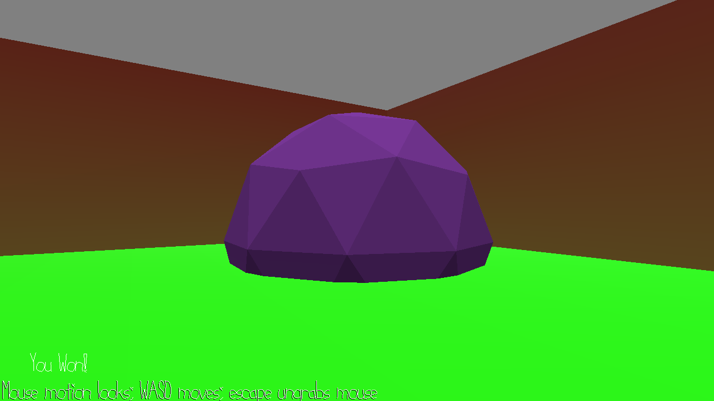

# GilgaMESH

Author: Thomas Wrabetz

Design: It's a maze.

Screen Shot:

How To Play:

Move with WASD. The blue sphere is the starting point. Find + touch the purple sphere to win.

Sources: Made all the stuff out of primitives in Blender.

This game was built with [NEST](NEST.md).

